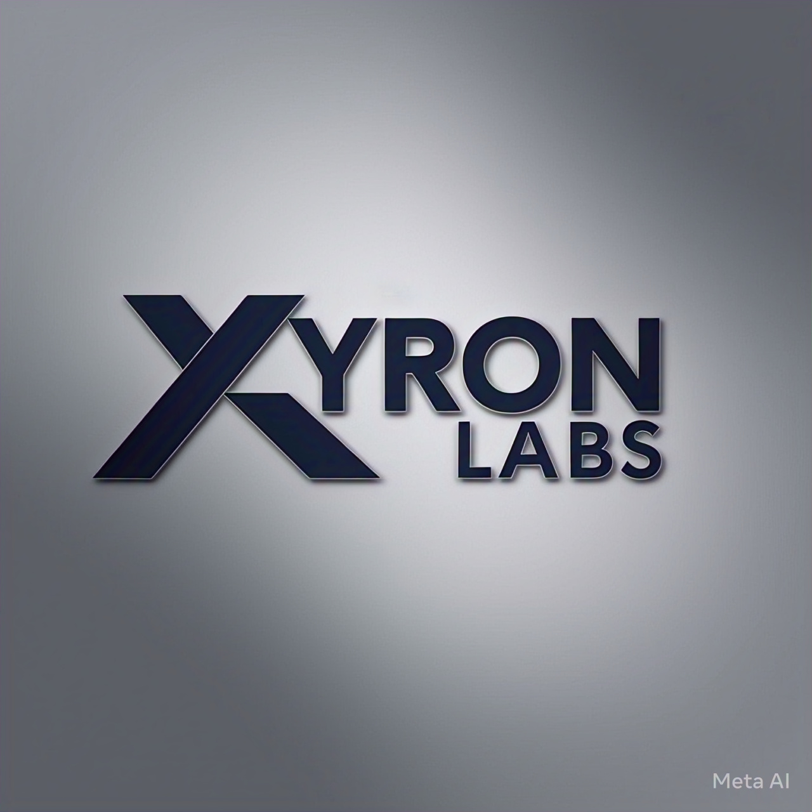

# Odysee Gen 1

A lightweight implementation of a language model built for learning and experimentation.
# Xyron Labs - Odysee Gen 1

<div style="text-align:center"></div>

Welcome to Odysee Gen 1, an open-source large language model project by Xyron Labs.


## Table of Contents
- [Overview](#overview)
- [Features](#features)
- [Installation](#installation)
- [Usage](#usage)
- [Contributing](#contributing)
- [License](#license)
- [Contact](#contact)

## Overview
Odysee Gen 1 is a learning project that implements a basic language model using PyTorch and the Transformers library. It serves as a foundation for understanding how language models work.

## Features
- Basic text generation capabilities
- Simple API interface
- Built on PyTorch and Transformers
- Support for different model sizes

## Installation
```bash
git clone https://github.com/threatthriver/odyseegen1.git
cd odyseegen1
pip install -r requirements.txt
```

## Usage
```python
from odysee import OdyseeModel

model = OdyseeModel.load("base")
response = model.generate("Your prompt here")
print(response)
```

## License
MIT License - see LICENSE file
